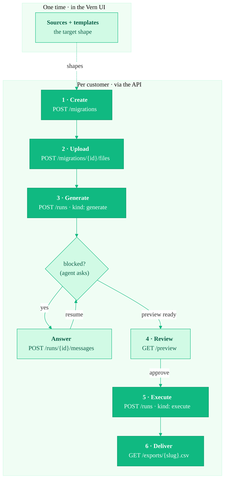

The Migration API lets you run Vern as a **headless migration engine** inside
your own product. Your end-customers never see a Vern dashboard — they stay in
your UI while Vern does the messy work of turning a customer's old data into
clean, validated records ready for your system.

You set up your **sources and templates once**, in the Vern UI — the target
shape you want every customer's data to land in. After that, each customer
migration is a short sequence of API calls, and a **managed agent** does the
mapping, cleaning, and validation for you.

## The lifecycle

Every call after setup is scoped to one **migration** — one customer's isolated
workspace:

1. **Create** — `POST /api/v1/migrations` creates a migration (a workbook with
   one sheet per template) for one customer.
2. **Upload** — `POST /api/v1/migrations/{id}/files` mints signed upload URLs;
   your customer's files are `PUT` straight to storage.
3. **Generate** — `POST /api/v1/migrations/{id}/runs` with `{ "kind": "generate" }`
   starts a **managed-agent run** that authors the mapping logic and stops at a
   **preview**. It's async; you poll the run. The agent can pause at **`blocked`**
   to ask you a question.
4. **Review** — `GET /api/v1/migrations/{id}/preview` returns the proposed
   output, sheet-per-template. Refine it with an `update` or `clarify` run, or
   approve it.
5. **Execute** — `POST /api/v1/migrations/{id}/runs` with `{ "kind": "execute" }`
   runs the approved recipe for real.
6. **Deliver** — download the validated data with
   `GET /api/v1/migrations/{id}/exports/{template_slug}.csv`.

To let your customer choose what to migrate, you can
[list sources](/migration-api/list-sources) and
[list templates](/migration-api/list-templates) before step 1 and render the
choices in your own UI.

See [Quickstart](/migration-api/quickstart) for the end-to-end flow.

## A managed agent, not a frozen replay

The migration runs on **one durable, tool-using agent** — the same agent that
powers Vern's interactive import UI, driven headlessly. The public API is a thin
shell over it: you start discrete **runs** (generate, update, clarify, execute)
and poll each to a terminal state.

For each migration the agent **reuses-or-authors** the mapping and validation
logic, verifies it in a sandbox, and **self-heals** through the rough edges of a
real customer file — renamed headers, reordered columns, stray formats — until it
passes. A correct migration may author fresh logic each time; **reuse is an
optimization, not a contract**. Your calls only ever reference the **migration** —
you never pass plan or recipe IDs.

Robustness comes from the agent's intrinsic ability to self-heal **and to ask**.
When a mapping is genuinely ambiguous — and neither the data nor your templates
settle it — the run pauses at **`blocked`** and surfaces a plain-language
question for you to render in your own UI. You answer (or send a free-form
correction) and the run resumes. Surviving invalid cells at the end are
**reported, not parked**, so you can take the valid rows and move on.

See [Core concepts](/migration-api/concepts) for how sources, templates,
migrations, and runs fit together, and
[Answer the agent](/migration-api/answer-questions) for the question flow.

## Next

- [Core concepts](/migration-api/concepts) — the model behind the API.
- [Quickstart](/migration-api/quickstart) — create, generate, review, and deliver in one sitting.
