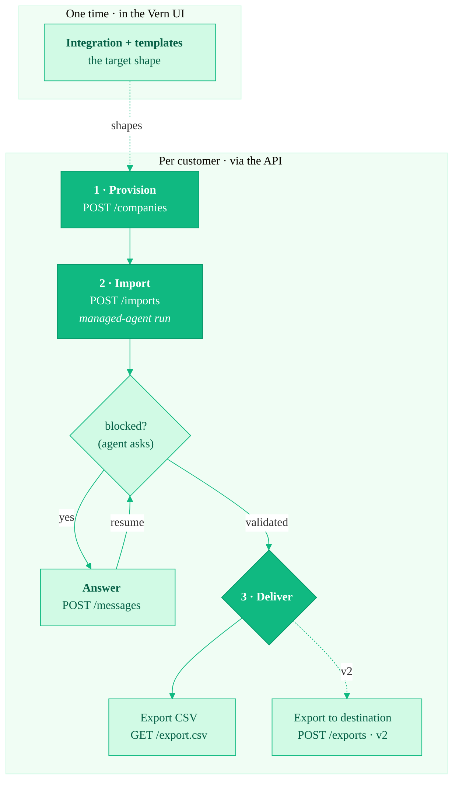

<Note>
  **Preview.** The Migration API is in active design with a small group of
  design partners. The surface below is what we're building and how we're
  thinking about it — endpoints and payloads may change before general
  availability. Want early access? Email [vish@vern.so](mailto:vish@vern.so).
</Note>

The Migration API lets you run Vern as a **headless migration engine** inside
your own product. Your end-customers never see a Vern dashboard — they stay in
your UI while Vern does the messy work of turning a customer's old data into
clean, validated records ready for your system.

You set up your **integration and templates once**, in the Vern UI — the target
shape you want every customer's data to land in. After that, each new customer
migration is **three API calls**, and a **managed agent** does the mapping,
cleaning, and validation for you.

## The three calls

A migration is three calls, all scoped to one **company** (one customer's
workspace):

1. **Provision** — `POST /api/v1/companies` creates a company (a workbook with
   one sheet per template) for one customer.
2. **Import** — `POST /api/v1/companies/{id}/imports` pushes their files and
   starts a **managed-agent run**. It's async; you poll for the result. The run
   can pause at **`blocked`** to ask you a question (see below).
3. **Deliver** — download the validated data as CSV with
   `GET /api/v1/companies/{id}/export.csv`. _(Pushing straight to a destination
   API with `POST /api/v1/companies/{id}/exports` is [v2](/migration-api/export-to-destination).)_

To let your customer choose what to migrate, you can
[list sources](/migration-api/list-sources) and
[list templates](/migration-api/list-templates) before step 1 and render the
choices in your own UI.

See [Quickstart](/migration-api/quickstart) for the end-to-end flow.

## A managed agent, not a frozen replay

The migration runs on **one durable, tool-using agent** — the same agent that
powers Vern's interactive import UI, driven headlessly. The public API is a thin
**create → poll → message** shell over it.

For each import the agent **reuses-or-authors** the mapping and validation logic,
verifies it in a sandbox, and **self-heals** through the rough edges of a real
customer file — renamed headers, reordered columns, stray formats — until it
passes. A correct migration may author fresh logic each time; **reuse is an
optimization, not a contract**. Your runtime calls only ever reference the
**company** — you never pass plan or recipe IDs.

Robustness comes from the agent's intrinsic ability to self-heal **and to ask**.
When a mapping is genuinely ambiguous — and neither the data nor your templates
settle it — the run pauses at **`blocked`** and surfaces a plain-language
question for you to render in your own UI. You answer (or send a free-form
correction) and the run resumes. Surviving invalid cells at the end are
**reported, not parked**, so you can take the valid rows and move on.

See [Core concepts](/migration-api/concepts) for how integrations, templates,
companies, and runs fit together, and
[Answer the agent](/migration-api/answer-questions) for the question flow.

## Next

- [Core concepts](/migration-api/concepts) — the model behind the API.
- [Quickstart](/migration-api/quickstart) — provision, import, and download in one sitting.
