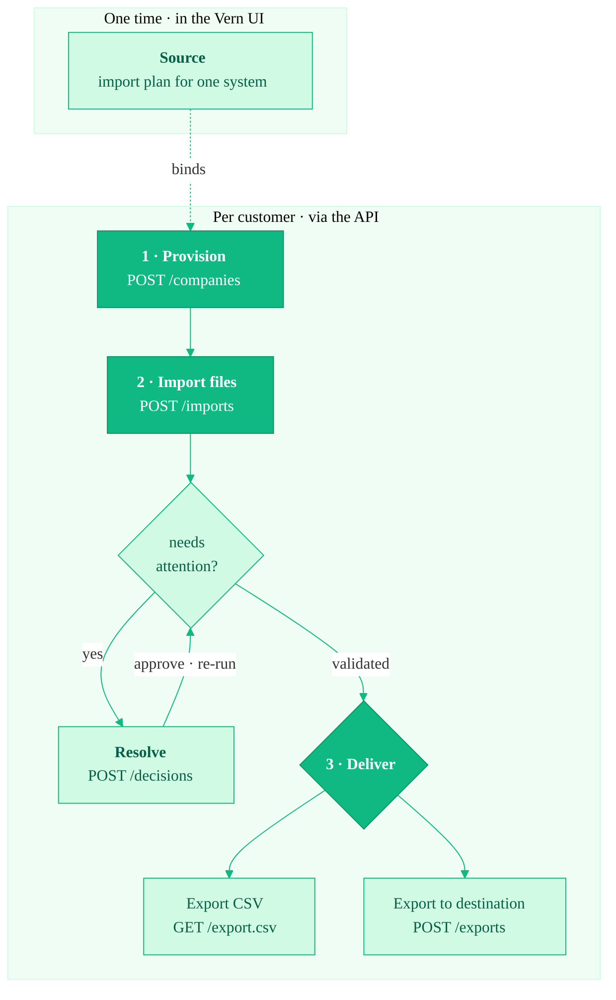

<Note>
  **Preview.** The Migration API is in active design with a small group of
  design partners. The surface below is what we're building and how we're
  thinking about it — endpoints and payloads may change before general
  availability. Want early access? Email [vish@vern.so](mailto:vish@vern.so).
</Note>

The Migration API lets you run Vern as a **headless migration engine** inside
your own product. Your end-customers never see a Vern dashboard — they stay in
your UI while Vern does the messy work of turning a customer's old data into
clean, validated records ready for your system.

You do the hard part **once**, in the Vern UI: author and publish the mapping
and validation logic for a source. After that, every new customer migration is a
few API calls.

## The shape of a source

A typical embedded migration is three steps:

1. **Provision** — `POST /api/v1/companies` creates a company for one customer.
2. **Import** — `POST /api/v1/companies/{id}/imports` pushes their files and runs
   your migration logic. It's async; you poll for the result.
3. **Deliver** — download the validated data as CSV with
   `GET /api/v1/companies/{id}/export.csv`, or push it to a destination system
   with `POST /api/v1/companies/{id}/exports`.

If an import flags rows that need a decision, you **resolve** them between steps 2
and 3 — see [Resolve flagged rows](/migration-api/resolve-flagged-rows).

To let your customer choose what to migrate, you can
[list sources](/migration-api/list-sources) and
[list templates](/migration-api/list-templates) before step 1 and render the
choices in your own UI.

See [Quickstart](/migration-api/quickstart) for the end-to-end flow.

## Replay, not questions

Vern's authoring experience is interactive and agentic — it asks clarifying
questions, proposes mappings, and validates as it goes. That all happens **once,
in the UI**, and produces a **frozen, versioned artifact** bound to your
source.

A normal import just **replays** that frozen logic headlessly, end to end, with
no human in the loop — it never re-asks what you settled at authoring time. When a
customer's file drifts from the shape you authored against, it **self-heals**
where it can and **reports** what it couldn't.

The only time questions come back is on *your* terms. If some rows still fail
validation, you can take the valid rows and move on — or **review**: Vern surfaces
the open questions and a proposed fix for you to render in your own UI, then
re-runs once you decide. See [Resolve flagged rows](/migration-api/resolve-flagged-rows).

See [Core concepts](/migration-api/concepts) for how sources, companies, and
runs fit together.

## Next

- [Core concepts](/migration-api/concepts) — the model behind the API.
- [Quickstart](/migration-api/quickstart) — provision, import, and download in one sitting.
